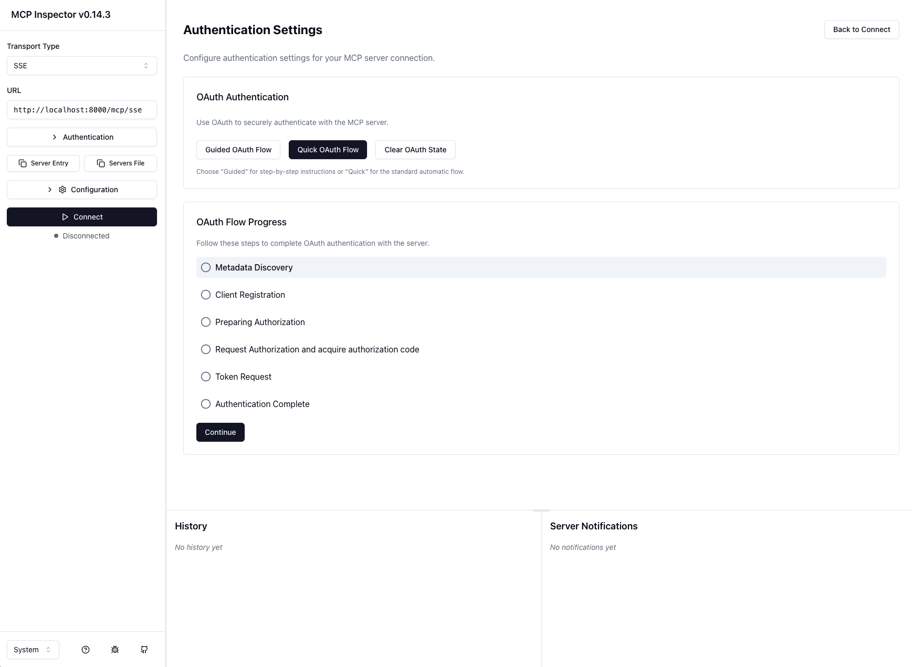
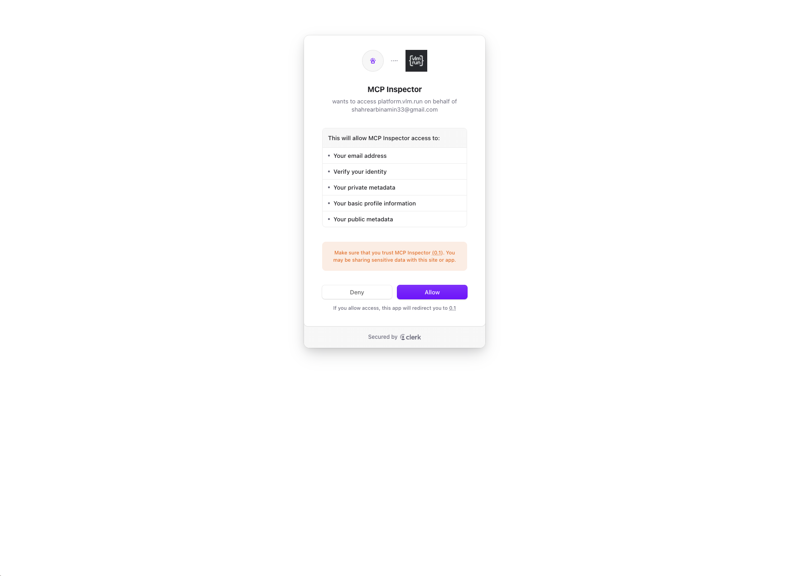
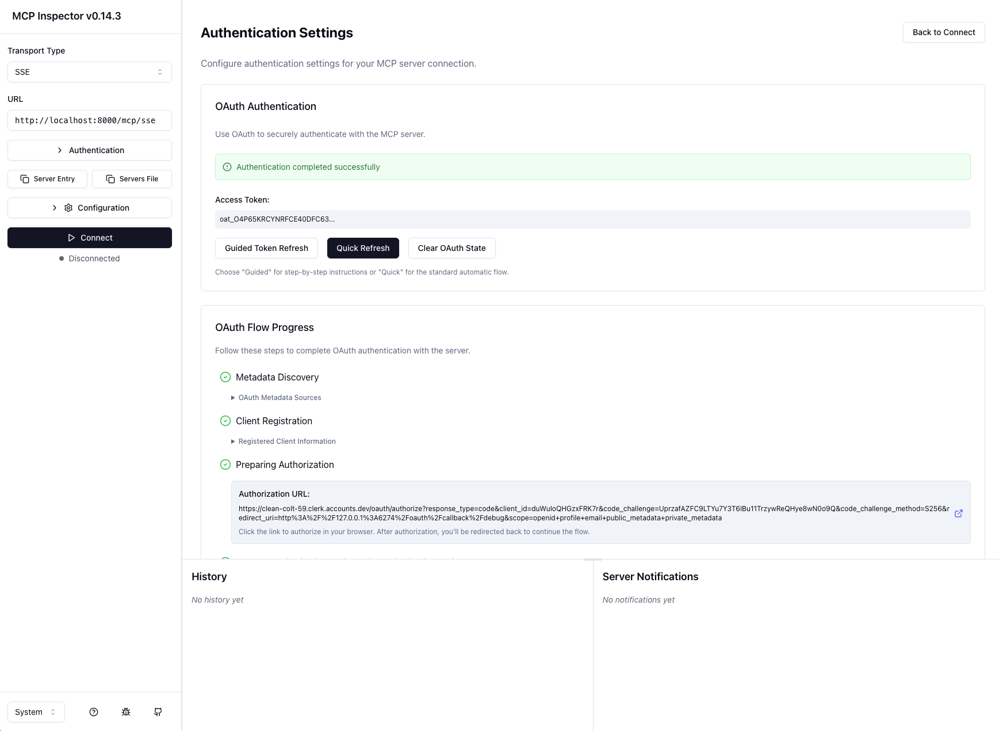
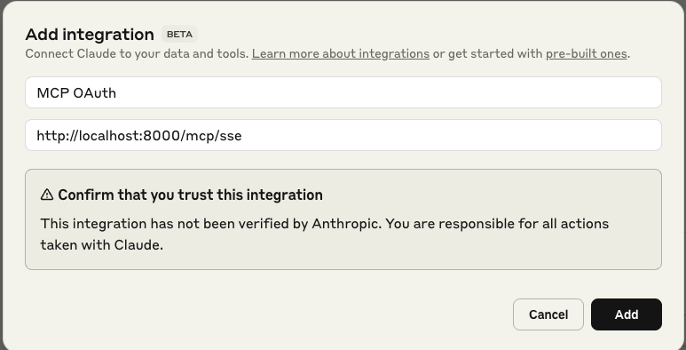

# MCP OAuth Server Example

This project demonstrates FastMCP server with Bearer token authentication mounted on FastAPI, including OAuth 2.1 endpoints for dynamic client registration and metadata discovery.

## MCP Server Setup

### Requirements

- Python 3.8+
- See `requirements.txt` for all dependencies

### Installation

```bash
pip install -r requirements.txt
```

### Env

```bash
cp .env.example .env
```

Create an OAuth application with any OAuth provider. (I've used [Clerk](https://clerk.com/) as an example.)  
Obtain the `client_id` and `client_secret` from your provider.  
Update your `.env` file with the appropriate environment variables:

```bash
CLERK_ISSUER=<issuer_url>
CLERK_AUDIENCE=<clerk_client_id>
CLERK_CLIENT_SECRET=<clerk_client_secret>
BASE_URL=http://localhost:8000
```

### Running the Server

```bash
python server.py
```

eg.

```bash
python server.py --transport sse --host 0.0.0.0 --port 8000 --log-level info
```

#### Command Line Options

```bash
python server.py --help
```

- `--transport`: Transport type (`sse` or `http`, default: `sse`)
- `--host`: Host address (default: `127.0.0.1`)
- `--port`: Port number (default: `8000`)
- `--log-level`: Logging level (default: `info`)

## Testing the Server

### Method 1: MCP Inspector

The [MCP Inspector](https://github.com/modelcontextprotocol/inspector) provides a web-based interface to test MCP servers with OAuth authentication.

1. **Configure the server URL**: Enter `http://localhost:8000/mcp/sse` in the MCP Inspector
   

2. **Initiate OAuth flow**: Click the "Quick OAuth Flow" button to start authentication
   

3. **Complete authentication**: Follow the OAuth steps and grant the necessary permissions
   

### Method 2: FastMCP Python Client

Use the [FastMCP Client](https://gofastmcp.com/clients/auth/oauth) for programmatic access with OAuth authentication.

1. **Update the client configuration**: Modify the server URL in `client.py` to match your server endpoint
2. **Run the client**:
   ```bash
   python client.py
   ```

### Method 3: Claude Integration

Integrate the MCP server directly with Claude for AI assistant access.

1. **Navigate to settings**: Go to Settings → Integrations → Add Integration
2. **Configure the server**: Input the server configuration details
   
3. **Establish connection**: Click "Connect" to enable the integration

## Server Endpoints

### Core Endpoints

- **MCP Server**: `http://127.0.0.1:8000/mcp` - Main MCP endpoint
- **Health Check**: `http://127.0.0.1:8000/mcp/health` - Server health status
- **API Documentation**: `http://127.0.0.1:8000/docs` - FastAPI auto-generated docs

### OAuth 2.1 Endpoints

- **Authorization Server Metadata**: `http://127.0.0.1:8000/.well-known/oauth-authorization-server`
- **OpenID Connect Discovery**: `http://127.0.0.1:8000/.well-known/openid-configuration`
- **Protected Resource Metadata**: `http://127.0.0.1:8000/.well-known/oauth-protected-resource`
- **Dynamic Client Registration**: `POST http://127.0.0.1:8000/register`

### Development Endpoints

- **Development Token**: `http://127.0.0.1:8000/dev/token` - Generate test tokens

## Environment Variables

You can configure the server using environment variables:

- `ISSUER`: JWT issuer (default: `https://dev.example.com`)
- `AUDIENCE`: JWT audience (default: `my-mcp-server`)
- `CLIENT_SECRET`: OAuth client secret (default: auto-generated UUID)
- `BASE_URL`: Base URL for the server (default: `http://127.0.0.1:8000`)

## Example MCP Tools

- `hello(name: str) -> str`: Returns a greeting message
- `add_numbers(a: int, b: int) -> int`: Adds two numbers together

Both tools require valid authentication.

## OAuth 2.1 Compliance

This server implements key OAuth 2.1 endpoints:

- Authorization Server Metadata Discovery
- Dynamic Client Registration (RFC 7591)
- Protected Resource Metadata (RFC 8705)

Note: This is a development/demonstration server. For production use, integrate with a proper OAuth 2.1 Authorization Server or Identity Provider.

## Features

- FastMCP server mounted on FastAPI
- Bearer token (JWT) authentication using RSA public key validation
- OAuth 2.1 Authorization Server metadata endpoints
- Dynamic client registration endpoint
- OpenID Connect discovery endpoint
- CORS middleware for cross-origin requests
- Structured logging with loguru
- Development token generation endpoint
- Health check endpoint
- Multiple MCP tools (hello, add_numbers)

## References

- [FastMCP Bearer Auth Documentation](https://gofastmcp.com/servers/auth/bearer)
- [fastmcp GitHub](https://github.com/jlowin/fastmcp)
- [OAuth 2.1 Specification](https://datatracker.ietf.org/doc/html/draft-ietf-oauth-v2-1)
- [RFC 7591 - OAuth 2.0 Dynamic Client Registration](https://tools.ietf.org/html/rfc7591)
